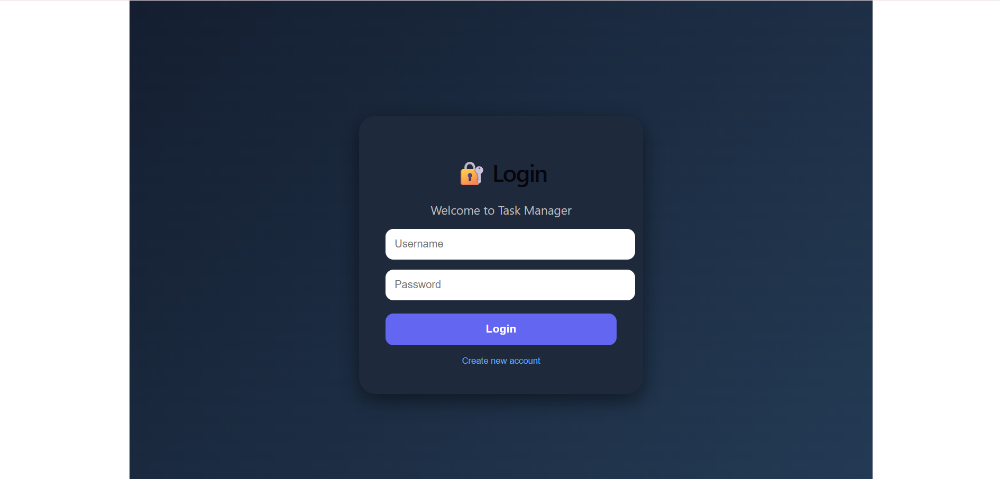
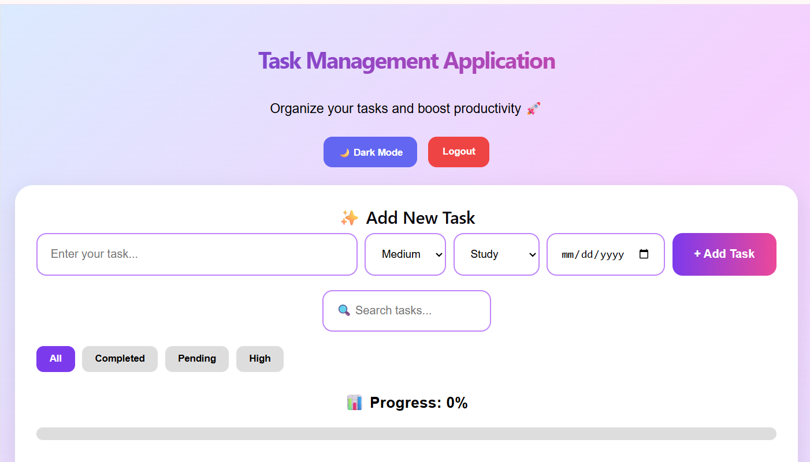
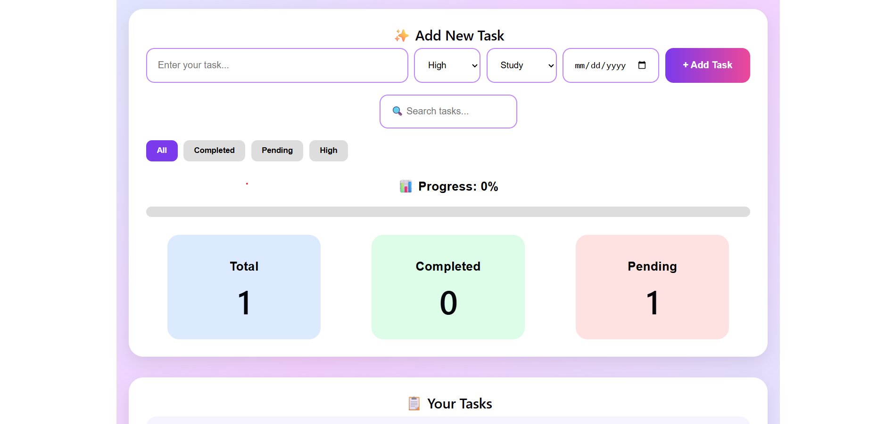
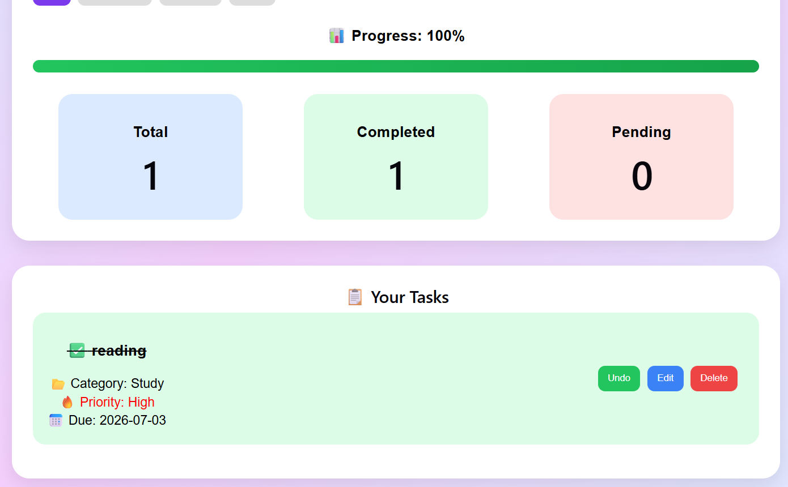
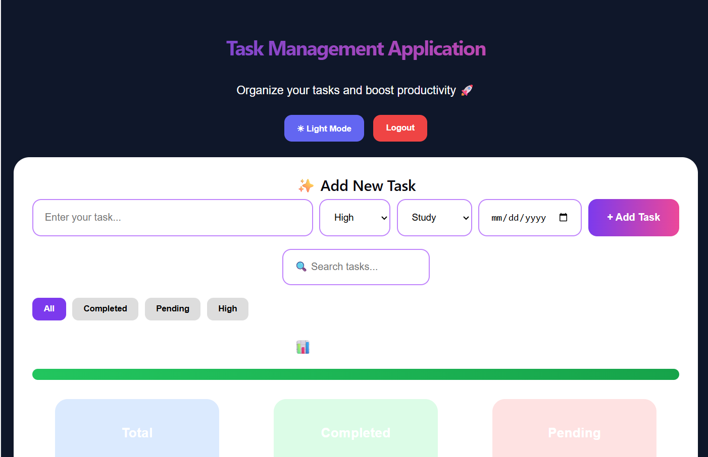

# 📋 Task Management Application

A modern and responsive **Task Management Application** built with **React.js** that helps users organize, prioritize, and track their daily activities efficiently.

The application provides an intuitive interface for managing tasks with features such as authentication, priority management, progress tracking, search and filtering, and productivity analytics.

---

## 🌐 Live Demo

**🔗 Live Website:** https://task-manager-app-plb6.vercel.app/

## 📂 GitHub Repository

**🔗 Repository:** https://github.com/likitha-yarraguntla/task-management-application

---

## ✨ Key Features

### 🔐 Authentication System

* User Registration (Sign Up)
* Secure Login System
* Local Storage Based Authentication
* Logout Functionality

### 📋 Task Management

* Create New Tasks
* Edit Existing Tasks
* Delete Tasks
* Mark Tasks as Completed
* Undo Completed Tasks

### 🎯 Task Organization

#### Priority Levels

* High 🔴
* Medium 🟠
* Low 🟢

#### Categories

* Study 📚
* Work 💼
* Health 🏃
* Personal 👤

### 🔍 Smart Features

* Instant Task Search
* Advanced Filtering

  * All Tasks
  * Completed Tasks
  * Pending Tasks
  * High Priority Tasks
* Due Date Management
* Overdue Task Detection

### 📊 Productivity Dashboard

* Total Tasks Counter
* Completed Tasks Counter
* Pending Tasks Counter
* Completion Percentage
* Visual Progress Bar

### 🎨 User Experience

* Responsive Design
* Modern User Interface
* Dark Mode 🌙
* Light Mode ☀️
* Interactive Controls
* Mobile-Friendly Layout

### 💾 Data Persistence

* Local Storage Integration
* Automatic Task Saving
* Persistent Login Sessions

---

## 🛠️ Tech Stack

### Frontend

* React.js
* JavaScript (ES6+)
* HTML5
* CSS3

### State Management

* React Hooks (useState, useEffect, useMemo)

### Storage

* Local Storage API

### Deployment

* Vercel

---

## 📂 Project Structure

```text
task-management-application/
├── public/
├── src/
│   ├── components/
│   ├── pages/
│   ├── App.js
│   └── main.jsx
├── package.json
└── README.md
```

---

## ⚙️ Installation & Setup

### Clone the Repository

```bash
git clone https://github.com/likitha-yarraguntla/task-management-application.git
```

### Navigate to Project Directory

```bash
cd task-management-application
```

### Install Dependencies

```bash
npm install
```

### Start Development Server

```bash
npm run dev
```

The application will run at:

```text
http://localhost:5173
```
## 📸 Project Screenshots

### 🔐 Login Page


### 📋 Dashboard


### ➕ Add Task


### ✅ Completed Tasks


### 🌙 Dark Mode

## 🚀 Learning Outcomes

Through this project, I gained practical experience in:

* React Hooks and State Management
* CRUD Operations
* Conditional Rendering
* Event Handling
* Local Storage Integration
* Responsive Web Design
* Component-Based Architecture
* Building Productivity Applications

---

## 🔮 Future Enhancements

* Multiple User Support
* Firebase Authentication
* Cloud Database Integration
* Email Notifications
* Task Reminders
* Drag-and-Drop Task Management
* User Profile Management
* Mobile Application Version

---

## 👩‍💻 Developer

**Likitha Yarraguntla**

Aspiring Full Stack Developer passionate about building responsive and user-friendly web applications using modern technologies.

* GitHub: https://github.com/likitha-yarraguntla
* LinkedIn: https://www.linkedin.com/in/likitha-yarraguntla-11a496395/
* LeetCode: https://leetcode.com/u/8309663069/

⭐ If you found this project useful, consider giving it a star on GitHub.
